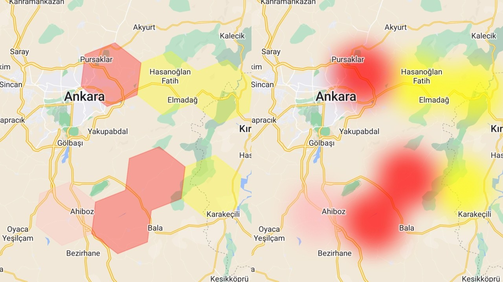

# google_map_smooth_polygon



This package provides functionality to create smooth transition polygons on Google Maps using Flutter. It helps users to render polygons with smooth edges and transitions, enhancing the visual appeal of map overlays.

## Features

- Smooth transition polygons on Google Maps.
- Customizable polygon styles and animations.
- Easy integration with existing Flutter projects.

## Getting Started

### Requirements

- Dart SDK version 2.12.0 or later
- Flutter SDK version 2.0.0 or later

### Installation

Add the package to your `pubspec.yaml` file:

```yaml
dependencies:
  google_map_smooth_polygon: ^1.0.0
```

Then run the following command in your terminal:

```bash
flutter pub get
```

## Usage

Below is a simple example of how to use the package:

```dart
import 'package:google_map_smooth_polygon/google_map_smooth_polygon.dart';

GoogleMap(
    tileOverlays: SmoothPolygon(
        polygons: polygons,
        baseBlurRadius: 30,
        transparency: 0.3,
        opacityLevels: [0.9, 0.01, 0.001, 0.0],
    ).createTileOverlays(),
),
```

For more detailed examples, please refer to the `/example` folder.

## Additional Information

- For more information, visit the [documentation link].
- If you want to contribute, please read the [contribution guide link].
- To report issues, use the [issue tracker link].
- The package authors typically respond within [response time].

## License

This project is licensed under the [License Name] license. For more details, see the `LICENSE` file.
